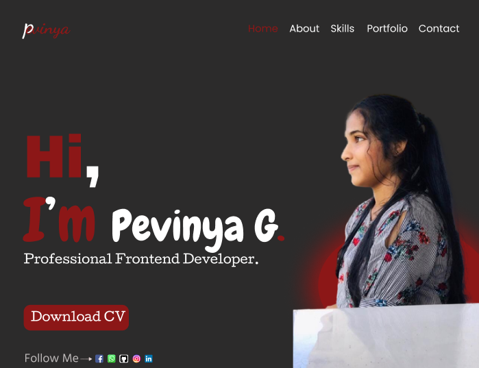

<<<<<<< HEAD
# Myportfolio
This is my website 
=======

<!--
*** Hey there! Thanks for stopping by my Portfolio project. If you have any suggestions
*** or feedback, feel free to reach out. I'm open to learning and improving! 🚀
*** Don't forget to give this project a star if you find it helpful! 🌟
*** Now let's embark on a journey of creativity and exploration! 🎉
-->

<!-- PROJECT LOGO -->
 

  

  <h1 align="center">🌟 Welcome to Pevinya Geenadi's Portfolio! 🌟</h1>

  

    Thank you for visiting my portfolio website! I'm excited to share my work with you. Let's connect and create something amazing together! 🚀
     
  

## About Project

<b>Hello, I'm Pevinya Geenadi! This project is my personal portfolio website where I showcase my projects, skills, and experiences in the world of web development.</b>

### Site Map

[https://www.gloomaps.com/gvD6NyzHVG](https://www.gloomaps.com/gvD6NyzHVG)

### Wire Frame

[https://wireframe.cc/pro/pp/df568048d665887](https://wireframe.cc/pro/pp/df568048d665887)

### Mockup

[https://www.figma.com/file/wKD2CGtQ4CYkiqJM14VMXX/Pevinya?type=design&mode=design&t=5tGmanMhvm79GCxB-1](https://www.figma.com/file/wKD2CGtQ4CYkiqJM14VMXX/Pevinya?type=design&mode=design&t=5tGmanMhvm79GCxB-1)

## Connect with Me

Feel free to reach out for collaboration or just to say hi! 📫

   &nbsp;&nbsp;

   &nbsp;&nbsp;

   &nbsp;&nbsp;

  :heart_eyes: Thanks for visiting my portfolio! Let's create something amazing together! :rocket:  
  &copy; 2023 Pevinya Geenadi

>>>>>>> 1db02355090bf4eb0b8d0f822fdc3dcab36676cf
